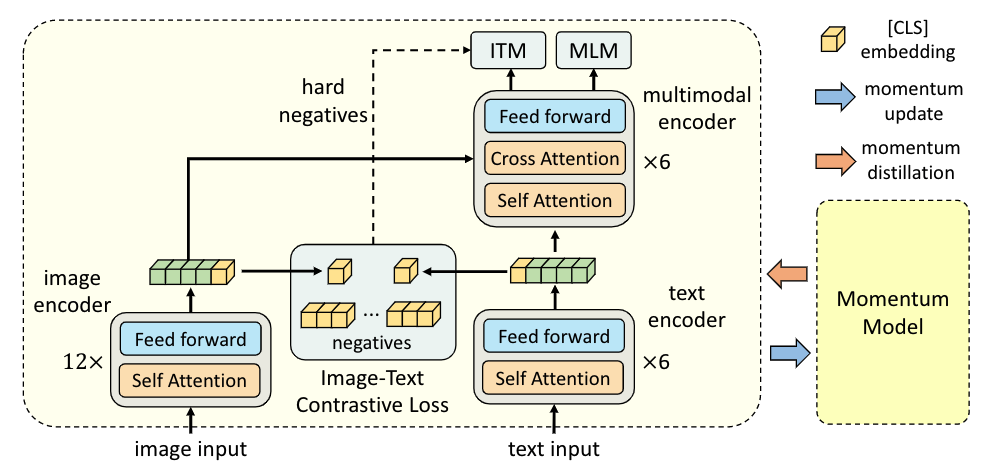
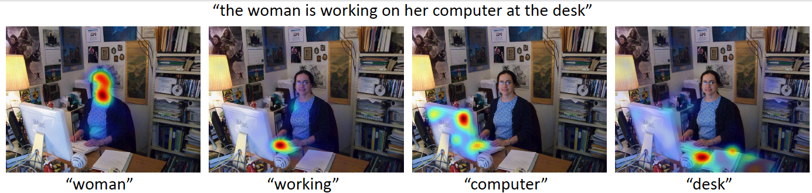

## Align before Fuse: Vision and Language Representation Learning with Momentum Distillation, NeurIPS 2021 Spotlight (Salesforce Research).

This is the official PyTorch implementation of the <a href="https://arxiv.org/abs/2107.07651">ALBEF paper</a> <a href="https://blog.salesforceairesearch.com/align-before-fuse/">[Blog]</a>. 
This repository supports pre-training on custom datasets, as well as finetuning on VQA, SNLI-VE, NLVR2, Image-Text Retrieval on MSCOCO and Flickr30k,
and visual grounding on RefCOCO+. Pre-trained and finetuned checkpoints are released.

### Requirements:
* pytorch 1.8.0
* transformers 4.8.1
* timm 0.4.9

### Download:

* Pre-trained checkpoint [[14M](https://storage.googleapis.com/sfr-pcl-data-research/ALBEF/ALBEF.pth)] / [[4M](https://storage.googleapis.com/sfr-pcl-data-research/ALBEF/ALBEF_4M.pth)]
* <a href="https://storage.googleapis.com/sfr-pcl-data-research/ALBEF/data.tar.gz"> Dataset json files for downstream tasks</a>
* <a href="https://storage.googleapis.com/sfr-pcl-data-research/ALBEF/json_pretrain.zip"> Dataset json files for pre-training</a> (the image paths in each json file need to be changed to your own directory)
* <a href="https://storage.googleapis.com/sfr-pcl-data-research/ALBEF/mscoco.pth"> Finetuned checkpoint for retrieval on MSCOCO </a>
* <a href="https://storage.googleapis.com/sfr-pcl-data-research/ALBEF/flickr30k.pth"> Finetuned checkpoint for retrieval on Flickr30k </a>
* <a href="https://storage.googleapis.com/sfr-pcl-data-research/ALBEF/vqa.pth"> Finetuned checkpoint for VQA </a>
* <a href="https://storage.googleapis.com/sfr-pcl-data-research/ALBEF/refcoco.pth"> Finetuned checkpoint for visual grounding on RefCOCO+ </a>

### Visualization:
We provide code in visualize.ipynb to visualize the important areas in an image for each word in a text. 
Here is an example visualization using the visual grounding checkpoint.

Try the Replicate demo here .

### Pre-training on custom datasets:
1. Prepare training json files where each json file contains a list. Each item in the list is a dictonary with two key-value pairs: {'image': path_of_image, 'caption': text_of_image}. 
2. In configs/Pretrain.yaml, set the paths for the json files.
3. Pre-train the model using 8 A100 GPUs:
<pre>python -m torch.distributed.launch --nproc_per_node=8 --use_env Pretrain.py --config ./configs/Pretrain.yaml --output_dir output/Pretrain </pre> 

### Image-Text Retrieval:

1. Download MSCOCO or Flickr30k datasets from the original websites.
2. Download and extract the provided dataset json files.
3. In configs/Retrieval_coco.yaml or configs/Retrieval_flickr.yaml, set the paths for the json files and the image path.
4. Finetune the pre-trained checkpoint using 8 A100 GPUs:
<pre>python -m torch.distributed.launch --nproc_per_node=8 --use_env Retrieval.py \
--config ./configs/Retrieval_flickr.yaml \
--output_dir output/Retrieval_flickr \
--checkpoint [Pretrained checkpoint]</pre> 

### VQA:
1. Download VQA v2 dataset and Visual Genome dataset from the original websites.
2. Download and extract the provided dataset json files.
3. In configs/VQA.yaml, set the paths for the json files and the image paths.
4. Finetune the pre-trained checkpoint using 8 A100 GPUs:
<pre>python -m torch.distributed.launch --nproc_per_node=8 --use_env VQA.py \
--config ./configs/VQA.yaml \
--output_dir output/vqa \
--checkpoint [Pretrained checkpoint]</pre> 
5. Evaluate the result using the official evaluation server.

### Visual Entailment:
1. Download SNLI-VE dataset from the original website.
2. Download and extract the provided dataset json files.
3. In configs/VE.yaml, set the paths for the json files and the image path.
4. Finetune the pre-trained checkpoint using 8 A100 GPUs:
<pre>python -m torch.distributed.launch --nproc_per_node=8 --use_env VE.py \
--config ./configs/VE.yaml \
--output_dir output/VE \
--checkpoint [Pretrained checkpoint]</pre> 

### Visual Grounding on RefCOCO+:
1. Download MSCOCO dataset from the original website.
2. Download and extract the provided dataset json files.
3. In configs/Grounding.yaml, set the paths for the json files and the image path.
4. Finetune the pre-trained checkpoint using 8 A100 GPUs:
<pre>python -m torch.distributed.launch --nproc_per_node=8 --use_env Grounding.py \
--config ./configs/Grounding.yaml \
--output_dir output/RefCOCO \
--gradcam_mode itm \ 
--block_num 8 \
--checkpoint [Pretrained checkpoint]</pre> 

### NLVR2:
NLVR2 requires an additional pre-training step with text-assignment (TA) to adapt the model for image-pair inputs. In order to perform TA, first set the paths for the json training files in configs/NLVR_pretrain.yaml, then run:
<pre>python -m torch.distributed.launch --nproc_per_node=8 --use_env Pretrain_nlvr.py \
--config ./configs/NLVR_pretrain.yaml \
--output_dir output/NLVR_pretrain \
--checkpoint [Pretrained checkpoint]</pre> 

We provide the <a href="https://storage.googleapis.com/sfr-pcl-data-research/ALBEF/pretrain_model_nlvr.pth"> checkpoint </a> after TA pre-training, which can be fine-tuned with the following steps.
1. Download NLVR2 dataset from the original website.
2. Download and extract the provided dataset json files.
3. In configs/NLVR.yaml, set the paths for the json files and the image path.
4. Finetune the pre-trained checkpoint using 8 A100 GPUs:
<pre>python -m torch.distributed.launch --nproc_per_node=8 --use_env NLVR.py \
--config ./configs/NLVR.yaml \
--output_dir output/NLVR \
--checkpoint [TA pretrained checkpoint]</pre> 

### Citation
If you find this code to be useful for your research, please consider citing.
<pre>
@inproceedings{ALBEF,
      title={Align before Fuse: Vision and Language Representation Learning with Momentum Distillation}, 
      author={Junnan Li and Ramprasaath R. Selvaraju and Akhilesh Deepak Gotmare and Shafiq Joty and Caiming Xiong and Steven Hoi},
      year={2021},
      booktitle={NeurIPS},
}</pre>
